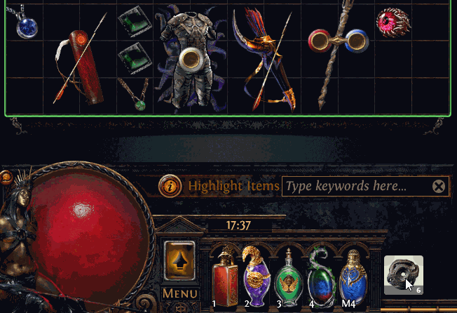
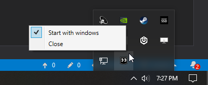

# Poe Lurker    |  [Cheat Sheet](assets/CheatSheet.md) | [User Guide](https://docs.google.com/presentation/d/1XhaSSNAFGxzouc5amzAW8c_6ifToNjnsQq5UmNgLXoo/present)
Poe Lurker is a simple yet very powerful trade manager meant to ease the trading experience for Path of Exile. 

If you like and use Poe Lurker please consider signing up for a small monthly [Patreon](https://www.patreon.com/poelurker) donation, even $2 can help tremendously. Furthermore you will become a [***Lurker Pro***](https://docs.google.com/presentation/d/1XhaSSNAFGxzouc5amzAW8c_6ifToNjnsQq5UmNgLXoo/present?slide=id.g71a37414b7_1_0) and you will unlock juicy features in the application.

 

  

# Shoutouts
| [SignPath.io](https://signpath.io/) for the free code signing | [Winook](https://github.com/macote/Winook) for the thread level hook | [MahApps](https://github.com/MahApps/MahApps.Metro) for the modern UI |
| ------------- | ------------- | ------------- |
|   |  |  |

## Usage
- Install ≥ [.NET Framework 4.8](https://dotnet.microsoft.com/download/dotnet-framework)
- Download and run [`PoeLurkerSetup.exe`](https://github.com/C1rdec/Poe-Lurker/releases/latest/download/PoeLurkerSetup.exe) from the [Releases Page](https://github.com/C1rdec/PoeLurker/releases).

## Key Features

- **Incoming Trades**

Keep track of your incoming trade request in a convenient overlay located above the exp bar.
The overlay will display the value of incoming trade request with 1 main action and 2 sub actions possible.
The main action have two states... The first one is to send the party invite and the other one is to send the trade request. Sub actions are meant to whisper that you are Busy and the other sub action is to deny. They are located in the top Left and Right corner of the main action represented by Blue and Red square.

- **Item highlight in stash.**

- **Outgoing Trades**

The overlay will display the first 4 letters of the playername. The trade request is represented by a button with 1 main action and 2 sub actions possible. The main action is to join the player hideout. Sub actions are meant to resend the offer and the other sub action is to deny. They are located in the top Left and Right corner of the main action..

- **Very simple to use.**  
You'll only need to start the application once since PoeLurker will Start/Stop with Path of Exile and the overlay will be placed automatically. You can even set the application to start when Windows start and dont think about it again. 

- **Auto Update.**  
Poe Lurker will detect that a new version can be installed and the tray icon will turn yellow with an additional option to "Update".

